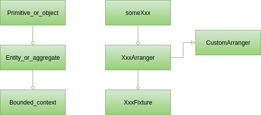

***

<p align="center">
  
</p>

<div align="center">
    <b><em>Test Arranger</em></b><br>

[](http://www.apache.org/licenses/)
[](https://github.com/ocadotechnology/test-arranger/actions)
[](https://repo1.maven.org/maven2/com/ocadotechnology/gembus/test-arranger/1.1/)
[](https://www.javadoc.io/doc/com.ocadotechnology.gembus/test-arranger/latest/index.html)

</div>

***

In TDD there are 3 phases: arrange, act and assert (given, when, then in BDD).
The assert phase has great tool support, you may be familiar with AssertJ, FEST-Assert or Hamcrest.
It is in contrast to the arrange phase.
While arranging test data is often challenging and significant part of the test is typically devoted to it, it is hard to point out a tool that supports it. 

Test Arranger tries to fulfill this gap by arranging instances of classes required for tests.
The instances are filled with pseudo-random values that simplify the process of test data creation.
The tester only declares types of the required objects and gets brand new instances.
When a pseudo-random value for a given field is not good enough, only this field must be set manually:

```java
Product product = Arranger.some(Product.class);
product.setBrand("Ocado");
```
### Maven
```xml
<dependency>
    <groupId>com.ocadotechnology.gembus</groupId>
  <artifactId>test-arranger</artifactId>
  <version>1.6.3</version>
</dependency>
```

### Gradle

```groovy
testImplementation 'com.ocadotechnology.gembus:test-arranger:1.6.3'
```

## Features

### Arranger

The Arranger class has several static methods for generating pseudo-random values of simple types.
Each of them has a wrapping function to make the calls simpler for Kotlin.
Some of the possible calls are listed below:

|Java|Kotlin| result                                                                                                                                                                                                                                                                                                                                                                                                                     |
|----|------|----------------------------------------------------------------------------------------------------------------------------------------------------------------------------------------------------------------------------------------------------------------------------------------------------------------------------------------------------------------------------------------------------------------------------|
|```Arranger.some(Product.class)```|```some<Product>()```| an instance of Product with all fields filled with values                                                                                                                                                                                                                                                                                                                                                                  |
|```Arranger.some(Product.class, "brand")```|```some<Product>("brand")```| an instance of Product without value for the brand field                                                                                                                                                                                                                                                                                                                                                                   |
|```Arranger.someSimplified(Category.class)```|```someSimplified<Category>()```| an instance of Category, fields of type collection has size reduced to 1 and depth for objects tree is limited to 3                                                                                                                                                                                                                                                                                                        |
|```Arranger.someObjects(Product.class, 7)```|```someObjects<Product>(7)```| a stream of size 7 of instances of Product                                                                                                                                                                                                                                                                                                                                                                                 |
|```Arranger.someEmail()```|```someEmail()```| a string containing email address                                                                                                                                                                                                                                                                                                                                                                                          |
|```Arranger.someLong()```|```someLong()```| a pseudo random number of type long                                                                                                                                                                                                                                                                                                                                                                                        |
|```Arranger.someFrom(listOfCategories)```|```someFrom(listOfCategories)```| an entry form the listOfCategories                                                                                                                                                                                                                                                                                                                                                                                         |
|```Arranger.someText()```|```someText()```| a string generated from a Markov Chain; by default, it is a very simple chain, but it can be reconfigured by putting other 'enMarkovChain' file on the test classpath with alternative definition, you can find one trained on an english corpus [here](https://github.com/ocadotechnology/test-arranger/releases/download/v1.1/enMarkovChain.zip); consult the included in the project 'enMarkovChain' file for the file format |
| - |```some<Product> {name = "not so random"}```| an instance of Product with all fields filled with random values except for `name` which is set to "not so random", this syntax can be used to set as many fields of the object as necessary, but each of the objects must be mutable                                                                                                                                                                                      |

### Adjusting the arranged data

Completely random data may be not suitable for every test case. 
Often there is at least one field that is crucial for the test goal and needs a certain value. 
When the arranged class is mutable, or it is a Kotlin data class, or there is a way to create an altered copy (e.g. [Lombok's @Builder(toBuilder = true)](https://projectlombok.org/features/Builder)) then just use what is available.
Fortunately, even if it is unadjustable, you can use the Test Arranger. 
There are dedicated versions of the ```some()``` and ```someObjects()``` methods that accept a parameter of type ```Map<String,Supplier>```.
The keys in this map represent field names whilst the corresponding suppliers deliver values that Test Arranger will set for you on those fields, e.g.:
```java
Product product = Arranger.some(Product.class, Map.of("name", () -> value));
```

### Custom Arrangers

By default, the random values are generated according to the field type.
Random values not always correspond well with class invariants.
When an entity always needs to be arranged concerning some rules regarding values of fields you may provide a custom arranger:
```java
class ProductArranger extends CustomArranger<Product> {
    @Override
    protected Product instance() {
        Product product = enhancedRandom.nextObject(Parent.class);
        product.setPrice(BigDecimal.valueOf(Arranger.somePositiveLong(9_999L)));
        return product;
    }
}
```
To have control over the process of instantiating ```Product``` we need to override the ```instance()``` method.
Inside the method we can create the instance of ```Product``` however we want.
Specifically, we may generate some random values.
For convenience, we have there a ```enhancedRandom``` field in the ```CustomArranger``` class.
In the given example, we generate an instance of ```Product``` with all fields having pseudo-random values, but then we change the price to something acceptable in our domain.
That is not negative and smaller than the 10k number.

The ```ProductArranger``` is automatically (using reflection) picked up by Arranger and used whenever new instance of ```Product``` is requested.
It not only regards direct calls like ```Arranger.some(Product.class)```, but also indirect.
Assuming there is class ```Shop``` with field ```products``` of type ```List<Product>```.
When calling ```Arranger.some(Shop.class)```, the arranger will use ```ProductArranger``` to create all the products stored in ```Shop.products```.

### Properties
The behaviour of the test-arranger can be configured using properties.
If you create `arranger.properties` file and save it in the root of classpath (usually that will be `src/test/resources/` directory), it will be picked up and the following properties will be applied:

* `arranger.root`
  The custom arrangers are picked up using reflection.
  All classes extending ```CustomArranger``` are considered to be custom arrangers.
  The reflection is focused on a certain package which by default is `com.ocado`.
  That not necessarily is convenient for you.
  However, with `arranger.root=your_package` it can be changed to `your_package`.
  Try to have the package as specific as possible as having something to generic (e.g. just `com` which is root package in many libraries) will result in scanning hundreds of classes which will take noticeable time.
* `arranger.randomseed`
  By default, always the same seed is used to initialize the underlying pseudorandom values generator.
  As a consequence, the subsequent executions will generate the same values.
  To achieve randomness across runs, i.e. to always start with other random values, setting `arranger.randomseed=true` is necessary.
* `arranger.cache.enable`
  The process of arranging random instances requires some time. 
  If you create a large number of instances and you do not need them to be completely random, enabling the cache may be the way to go.
  When enabled, the cache stores reference to each random instance and at some point the test-arranger stops creating new ones and instead reuses the cached instances.
  By default the cache is disabled.
* `arranger.overridedefaults`
  Test-arranger respects the default field initialization, i.e. when there is a field initialized with an empty string, the instance returned by test-arranger has the empty string in this field.
  Not always it is what you need in the tests, especially, when there is a convention in the project to initialize fields with empty values.
  Fortunately, you can force test-arranger to overwrite the defaults with random values.
  Set `arranger.overridedefaults` to true to override the default initialization.
* `arranger.maxRandomizationDepth`
  Some test data structures can generate any length chains of objects that reference each other. 
  However, to effectively use them in a test case, it's crucial to control the length of these chains. 
  By default, Test-arranger stops creating new objects at the 4th level of nesting depth. 
  If this default setting does not suit your project test cases, it can be adjusted using this parameter.

### Data.copy

When you have a Java record that could be used as test data, but you need to change one or two of its fields, the `Data` class with its copy method provides a solution.
This is particularly useful when dealing with immutable records that don't have an obvious way to alter their fields directly.

The `Data.copy` method allows you to create a shallow copy of a record while selectively modifying the desired fields.
By providing a map of field overrides, you can specify the fields that need to be altered and their new values. 
The copy method takes care of creating a new instance of the record with the updated field values.

This approach saves you from manually creating a new record object and setting the fields individually, providing a convenient way to generate test data with slight variations from existing records.

Overall, the Data class and its copy method rescue the situation by enabling the creation of shallow copies of records with selected fields altered, providing flexibility and convenience when working with immutable record types:
```java
Data.copy(myRecord, Map.of("recordFieldName", () -> "altered value"));
```

## The challenges it solves

When going through tests of a software project one seldom has the impression that it cannot be done better.
In the scope of arranging test data, there are two areas we are trying to improve with Test Arranger.

### Tests readability

Tests are much easier to understand when knowing the intention of the creator, i.e why the test was written and what kind of issues it should detect.
Unfortunately, it is not extraordinary to see tests having in the arrange (given) section statements like the following one:
```java
Product product = Product.builder()
    .withName("Some name")
    .withBrand("Some brand")
    .withPrice(new BigDecimal("12.99"))
    .withCategory("Water, Juice & Drinks / Juice / Fresh")
...
    .build();
```
When looking at such code, it is hard to say which values are relevant for the test and which are provided only to satisfy some not-null requirements.
If the test is about the brand, why not write it like that:
```java
Product product = Arranger.some(Product.class);
product.setBrand("Some brand");
```
Now it is obvious that the brand is important.
Let's try to make one step further.
The whole test may look as follows:
```java
//arrange
Product product = Arranger.some(Product.class);
product.setBrand("Some brand");

//act
Report actualReport = sut.createBrandReport(Collections.singletonList(product))

//assert
assertThat(actualReport.getBrand).isEqualTo("Some brand") 
```
We're testing now that the report was created for the "Some brand" brand.
But is that the goal?
It makes more sense to expect that the report will be generated for the same brand, the given product is assigned to.
So what we want to test is:
```java
//arrange
Product product = Arranger.some(Product.class);

//act
Report actualReport = sut.createBrandReport(Collections.singletonList(product))

//assert
assertThat(actualReport.getBrand).isEqualTo(product.getBrand()) 
```
In case the brand field is mutable and we're afraid the `sut` may modify it, we can store its value in a variable before going into act phase and later use it for the assertion.
The test will be longer, but the intention remains clear.

It is noteworthy that what we have just done is an application of Generated Value and to some extent Creation Method patterns described in *xUnit Test Patterns: Refactoring Test Code* by Gerard Meszaros.

### Shotgun surgery

Have you ever changed a tiny thing in production code and end up with errors in dozen of tests?
Some of them reporting failing assertion, some maybe even refusing to compile.
This is a shotgun surgery code smell that just shot at your innocent tests.
Well, maybe not so innocent as they could be designed differently, to limit the collateral damage caused by tiny change.
Let's analyze it using an example.
Suppose we have in our domain the following class:
```java
class TimeRange{
    private LocalDateTime start;
    private long durationinMs;

    public TimeRange(LocalDateTime start, long durationInMs) {
        ...
```
and that it is used in many places.
Especially in the tests, without Test Arranger, using statements like this one: ```new TimeRange(LocalDateTime.now(), 3600_000L);```
What will happen if for some important reasons we are being forced to change the class to:
```java
class TimeRange {
    private LocalDateTime start;
    private LocalDateTime end;

    public TimeRange(LocalDateTime start, LocalDateTime end) {
        ...
```
It is quite challenging to come up with a series of refactoring that transforms the old version to the new one without breaking all dependent tests.
More likely is a scenario where the tests are adjusted to the new API of the class one by one.
This means a lot of not exactly exciting work with many questions regarding the desired value of duration (should I carefully convert it to the ```end``` of LocalDateTime type or was it just a convenient random value).
The life would be much easier with Test Arranger.
When in all places requiring just not null ```TimeRange``` we have ```Arranger.some(TimeRange.class)```, it is as good for the new version of ```TimeRange``` as it was for the old one.
That leaves us with those few cases requiring not random ```TimeRange```, but as we already use Test Arranger to reveal test intention, in each case we exactly know what value should be used for the ```TimeRange```.

But, that is not everything we can do to improve the tests.
Presumably, we can identify some categories of the ```TimeRange``` instance, e.g. ranges from past, ranges from future and ranges currently active.
The ```TimeRangeArranger``` is a great place to arrange that:
```java
class TimeRangeArranger extends CustomArranger<TimeRange> {

    private final long MAX_DISTANCE = 999_999L;

    @Override
    protected TimeRange instance() {
        LocalDateTime start = enhancedRandom.nextObject(LocalDateTime.class);
        LocalDateTime end = start.plusHours(Arranger.somePositiveLong(MAX_DISTANCE));
        return new TimeRange(start,end);
    }

    public TimeRange fromPast() {
        LocalDateTime now = LocalDateTime.now();
        LocalDateTime end = now.minusHours(Arranger.somePositiveLong(MAX_DISTANCE));
        return new TimeRange(end.minusHours(Arranger.somePositiveLong(MAX_DISTANCE)), end);
    }

    public TimeRange fromFuture() {
        LocalDateTime now = LocalDateTime.now();
        LocalDateTime start = now.plusHours(Arranger.somePositiveLong(MAX_DISTANCE));
        return new TimeRange(start, start.plusHours(Arranger.somePositiveLong(MAX_DISTANCE)));
    }

    public TimeRange currentlyActive() {
        LocalDateTime now = LocalDateTime.now();
        LocalDateTime start = now.minusHours(Arranger.somePositiveLong(MAX_DISTANCE));
        LocalDateTime end = now.plusHours(Arranger.somePositiveLong(MAX_DISTANCE));
        return new TimeRange(start, end);
    }
}
```
Such a creation method should not be created upfront but rather correspond with existing test cases.
Nonetheless, there are chances that the ```TimeRangeArranger``` will cover all cases where instances of ```TimeRange``` are created for tests.
As a consequence, in place of constructor calls with several mysterious parameters, we have arranger with a well-named method explaining the domain meaning of the created object and helping in understanding test intention. 

## How to organize tests with Test Arranger

We identified two levels of test data creators when discussing the challenges solved by Test Arranger.
To make the picture complete we need to mention at least one more, that is the Fixtures.
For the sake of this discussion, we may assume that Fixture is a class designed to create complex structures of test data.
The custom arranger is always focused on one class, but sometimes you can observe in your test cases reoccurring constellations of two or more classes.
That may be User and his or her Bank account.
There may be a CustomArranger for each of them, but why ignore the fact that they often come together.
This is when we should start thinking about a Fixture.
It will be responsible for creating both User and the Bank account (presumably using dedicated custom arrangers) and linking them together.
The Fixtures are described in detail, including several implementation variants in *xUnit Test Patterns: Refactoring Test Code* by Gerard Meszaros.

So we have three types of building blocks in the test classes.
Each of them can be considered to be the counterpart of a concept (Domain Driven Design building block) from production code:


On the surface, there are primitives and simple objects.
That is something that appears even in the simplest unit tests.
You can cover arranging such test data with the `someXxx` methods from ```Arranger``` class.

So you may have services requiring tests that work solely on `User` instances or both `User` and other classes contained in the `User` class, like a list of addresses.
To cover such cases, typically a custom arranger is required, i.e. the `UserArranger`.
It will create instances of `User` respecting all constraints and class invariants.
Moreover, it will pick up `AddressArranger`, when exists, to fill the list of addresses with valid data.
When several test cases require a certain type of user, e.g. homeless users with an empty list of addresses, an additional method can be created in the UserArranger.
As a consequence, whenever it will be required to create a `User` instance for the tests, it will be enough to look into `UserArranger` and select an adequate factory method or just call `Arranger.some(User.class)`.

The most challenging case regards tests depending on large data structures.
In eCommerce that could be a shop containing many products, but also user accounts with shopping history.
Arranging data for such test cases is usually non-trivial and repeating such a thing wouldn't be wise.
It is much better to store it in a dedicated class under a well-named method, like `shopWithNineProductsAndFourCustomers`, and reuse in each of the tests.
We strongly recommend to use a naming convention for such classes, in order to make them easy to find, our suggestion is to use `Fixture` postfix.
Eventually, we may end up with something like this:
```java
class ShopFixture {
    Repository repo;
    public void shopWithNineProductsAndFourCustomers() {
      Arranger.someObjects(Product.class, 9)
              .forEach(p -> repo.save(p));

      Arranger.someObjects(Customer.class, 4)
              .forEach(p -> repo.save(p));
    }
}
```

## Articles and blog posts

* [On testing in DDD](https://medium.com/p/f250482b5717)
* Test Arranger and the Second Law of Thermodynamics ([EN](https://www.youtube.com/watch?v=rAi2t05Om3Y#t=43s), [PL](https://www.youtube.com/watch?v=ulW0aRmDIuE))
* [Arranging Java Records](https://medium.com/@marian.jureczko/arranging-java-records-d11ec9141fde)
* [Flaky tests: the handy simplification](https://medium.com/@marian.jureczko/flaky-tests-the-handy-simplification-6e4296a0d71b)
* [FAQ](https://medium.com/@marian.jureczko/test-arranger-the-asked-questions-a4ec99a0f742)

## Versioning

The newest test-arranger version is compiled using Java 17 and should be used in Java 17+ runtime.
However, there is also a Java 8 branch for backward compatibility, covered with the 1.4.x versions.
